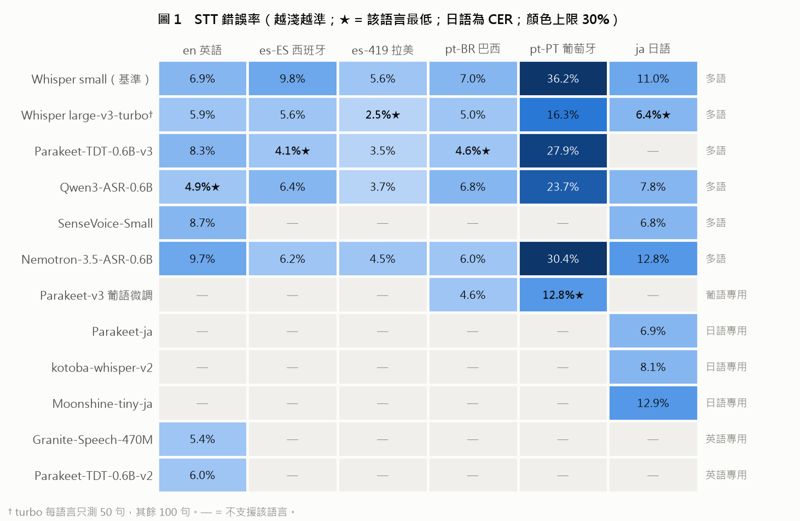
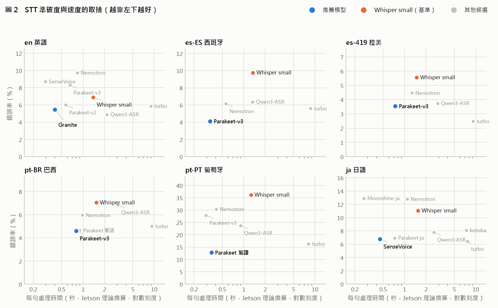
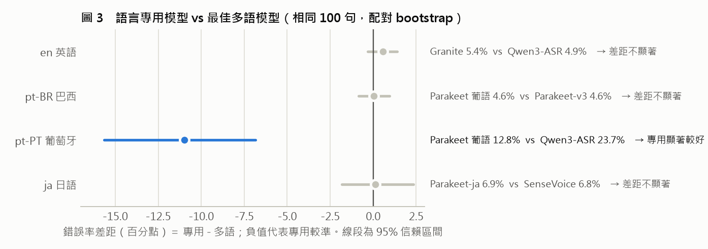
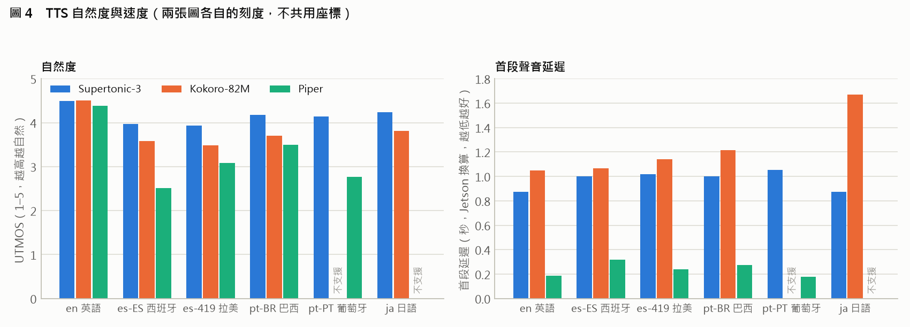
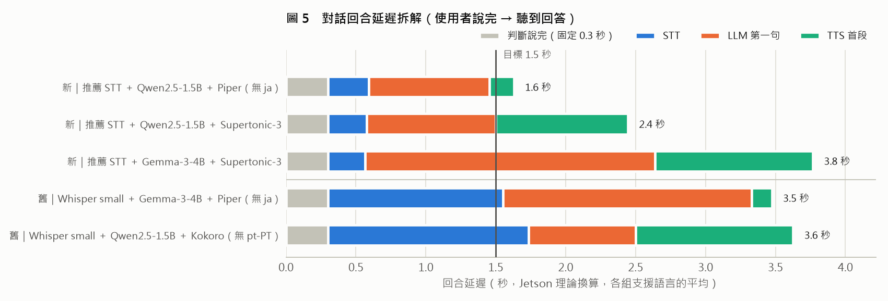

# 多語語音模型評測：結論報告

**日期**：2026-10-05　**範圍**：STT（語音辨識）、TTS（語音合成）、語音對話（STT → LLM → TTS）　**目標裝置**：NVIDIA Jetson Orin NX 16GB
**語言**：英語（en）、西班牙西語（es-ES）、拉美西語（es-419）、巴西葡語（pt-BR）、葡萄牙葡語（pt-PT）、日語（ja）

---

## 摘要

**結論：6 種語言都已找到準確度達標的小型模型；新組合的對話延遲實測約 2.4 秒（Jetson 換算），距目標 1.5 秒還差約 1 秒，需 Jetson 實測確認。**

1. **STT 以 NVIDIA Parakeet 系列為主力**：西語、巴西葡語用 Parakeet-TDT-0.6B-v3（錯誤率 3.5–4.6%），比基準 Whisper small 顯著更準、快 2–4 倍。
2. **pt-PT 已解決**：葡語微調版 Parakeet 錯誤率 12.8%（Whisper small 為 36.2%，不合格），且速度快。
3. **日語用 SenseVoice-Small**：錯誤率 6.8%（Whisper small 11.0%），記憶體僅約 0.3 GB。
4. **TTS 可用單一模型 Supertonic-3 涵蓋全部 6 種語言**：自然度在 5 種語言排名第一，記憶體最小（約 0.5 GB）。
5. **語言專用模型只在 pt-PT 有顯著優勢**（−11.0 個百分點）；其他語言多語模型就足夠。
6. **對話延遲大幅縮短但仍未達標**：新組合實測約 2.4 秒（舊組合 3.6 秒），目標 1.5 秒；TTS 改用 Piper 可達 1.6 秒，但自然度較差。仍需 Jetson 實測與進一步優化。

**需要的支援**：Jetson Orin NX 實機（驗證速度）、各語言母語者（聽測口音與自然度，特別是 pt-PT 與西語）。

---

## 1. 評測範圍與方法

| 項目 | 內容 |
|---|---|
| 測試量 | STT 16 個模型、TTS 3 個、LLM 4 個（9 個對話組合），共 3 晚＋1 次對話補測、約 22 小時 |
| STT 資料 | 每語言 100 句：FLEURS（en、es-419、pt-BR、ja）、Common Voice 27.0（es-ES：伊比利半島口音；pt-PT：葡萄牙口音，已排除專業術語清單）。所有模型在**相同句子**上比較 |
| TTS / 對話資料 | 自寫導覽文本每語言 10 句；導覽問答每語言 6 題 |
| 準確度 | STT：WER（日語 CER）＋ 95% 信賴區間；差距以配對 bootstrap 檢定。TTS：UTMOS（預測自然度 1–5）、Whisper 回測錯誤率。已統一數字寫法（例：dezenove = 19） |
| 速度 | 開發機（Intel i3-10110U，無 GPU）實測，以理論係數換算 Jetson（**未經實機校準，僅供排序**） |
| 門檻 | 錯誤率 ≤ 30%、STT / TTS 記憶體各 ≤ 2 GB、Jetson RTF ≤ 0.5、對話回合延遲目標 1.5 秒 |

---

## 2. STT（語音辨識）

- **Whisper large-v3-turbo 最準但太慢**：在 es-419、ja 錯誤率最低，但 Jetson 換算每句約 8–9 秒（圖 2 最右側），不適合即時對話。
- **Parakeet-v3 是西語、巴西葡語的最佳平衡點**：準確度接近 turbo，每句約 0.3–0.8 秒（Whisper small 約 1.3–1.5 秒）。其英語（8.3%）較弱，英語另用 Granite-Speech-470M（5.4%）。
- **pt-PT 只有葡語微調的 Parakeet 兼顧準確度與速度**：12.8%、每句約 0.35 秒。
- **日語 SenseVoice（6.8%）與 Parakeet-ja（6.9%）並列**，SenseVoice 記憶體小得多（0.3 GB vs 1.1 GB）。
- **不建議**：Whisper tiny / base（錯誤率過高）、medium（記憶體 2.4 GB 超出預算）、Nemotron-3.5（英語、日語、pt-PT 都比 Whisper small 差；串流不影響準確度，但開發機無法量出串流的真實延遲）。

---

## 3. 語言專用 vs 多語模型

| 語言 | 專用 | 多語 | 差距（95% 信賴區間） | 結論 |
|---|---|---|---|---|
| en | Granite 5.4% | Qwen3-ASR 4.9% | +0.6（−0.3～+1.4） | 不顯著 |
| pt-BR | Parakeet 葡語 4.6% | Parakeet-v3 4.6% | 0.0（−0.9～+1.0） | 不顯著 |
| **pt-PT** | **Parakeet 葡語 12.8%** | Qwen3-ASR 23.7% | **−11.0（−15.7～−6.8）** | **專用顯著較好** |
| ja | Parakeet-ja 6.9% | SenseVoice 6.8% | +0.1（−1.8～+2.3） | 不顯著 |

**結論**：只有 pt-PT 值得採用專用（葡語）模型；其他語言用多語模型即可，部署較簡單。英語採用 Granite 的理由是**速度**（每句 0.4 秒 vs Qwen3-ASR 2.2 秒），而非準確度。

---

## 4. TTS（語音合成）

| 模型 | 支援語言 | 自然度（UTMOS） | 回測錯誤率 | 首段延遲（Jetson 換算） | 記憶體 |
|---|---|---|---|---|---|
| **Supertonic-3** | **全部 6 種** | 3.94–4.49，**5 種語言第一** | 1.3–5.1% | 約 0.9–1.1 秒 | **約 0.5 GB** |
| Kokoro-82M | 無 pt-PT | 3.48–4.50 | 0.0–2.1% | 約 1.0–1.7 秒 | 約 1.5 GB |
| Piper | 無 ja | 2.52–4.39 | 0.7–12.4% | **約 0.2–0.3 秒** | 約 0.8 GB |

- **Supertonic-3 可作為單一通用 TTS**：唯一支援全部語言、最自然、最省記憶體。尚待母語者確認 pt-PT 是否為葡萄牙口音、西語方言，以及西語回測錯誤率（約 4–5%）偏高的原因。
- **Piper 是速度備案**：首段延遲最短，但 es-ES、pt-PT 自然度低。

---

## 5. 語音對話（端到端延遲）

新組合的 STT 依語言使用推薦模型（en Granite、es-ES / es-419 / pt-BR Parakeet-v3、pt-PT 葡語微調 Parakeet、ja SenseVoice）；舊組合為先前測試結果。Jetson 理論換算，各組支援語言的平均。

- **新組合實測約 2.4 秒，比舊組合快約 30–45%**：各語言 2.0–2.6 秒（pt-PT 3.4 秒），優於先前推估的 2.7 秒。STT 從約 1.3–1.4 秒降到約 0.3 秒，已不是瓶頸。
- **TTS 改用 Piper 可達 1.6 秒（pt-BR 1.5 秒），接近目標**，但 es-ES、pt-PT 自然度低（UTMOS 約 2.6）且不支援日語，只適合當速度備案。
- **剩下的延遲主要在 LLM 第一句（約 0.9 秒）與 Supertonic 首段（約 0.9 秒）**。
- **LLM**：Qwen2.5-1.5B 最快；Gemma-3-4B 回答較準，但延遲多約 1.3 秒（3.8 秒）；**Gemma-3-1B 淘汰**（事實正確率 50–67%，且會用錯語言回答）。每語言僅 6 題，回答品質結論仍屬初步。
- 要達到 1.5 秒，可再嘗試：TTS 第一段在逗號處就先唸、要求 LLM 第一句簡短、常見問答預錄；LLM 與 TTS 並行可減少句間停頓，留到 Jetson 實作。

---

## 6. 風險與限制

| 項目 | 影響 | 對策 |
|---|---|---|
| **速度為理論換算** | Jetson 實際速度可能差很多，推薦可能改變 | Jetson 實機校準（最優先） |
| 自然度靠 UTMOS | UTMOS 以英語資料訓練，非英語僅供相對比較 | 母語者聽測（已備有試聽頁與評分表） |
| 方言口音未確認 | Supertonic、Kokoro 不區分 pt-PT / pt-BR、es-ES / es-419 | 母語者聽測 |
| 葡語微調 Parakeet 只有 fp32 | 記憶體約 3.1 GB，超出 STT 預算 | 量化成 int8（預估約 1 GB）並驗證準確度 |
| 開發機記憶體偏高 | Qwen3-ASR、Nemotron、Granite 在 CPU 以 fp32 執行，Jetson 以 fp16 約減半 | Jetson 實測 |
| 未測噪音與幻覺 | 導覽現場有人聲干擾 | 短名單做噪音（SNR 10 dB）與靜音幻覺測試 |
| 對話題目少、問題為 TTS 合成 | 回答品質、STT 表現可能偏樂觀 | 擴充題目、改用真人錄音 |
| LLM 未以照護情境評測 | 對話題目為導覽問答，無法代表醫學常識與安全行為（緊急通報、不越權給建議） | LLM 照護情境評測（已規劃，題目待醫護審核） |
| 授權 | 皆可用於 PoC；SenseVoice（FunASR 模型授權）、Supertonic（OpenRAIL-M，含使用限制）商用前需法務確認 | 商用前確認 |

---

## 7. 下一步

1. **Jetson 實機測試**：Parakeet、SenseVoice、Granite、Supertonic、Piper 的實際速度；校準換算係數。
2. **母語者聽測**：Supertonic 的 pt-PT 口音與西語方言。
3. **葡語微調 Parakeet 量化成 int8**，確認準確度不變。
4. **LLM 照護情境評測**：醫學常識（公開資料集）與安全行為（緊急情況通報、不給診斷與用藥建議）；選型時一併考量延遲。
5. **對話延遲優化**：TTS 首段切短、LLM 第一句簡短、常見問答預錄；Jetson 上實作 LLM 與 TTS 並行。
6. **穩健性測試**：噪音錯誤率、幻覺率；以及自錄導覽情境語音。

---

## 8. 總表：各語言推薦模型

| 語言 | STT 推薦 | 錯誤率 | 每句處理時間¹ | STT 備選 | TTS 推薦 | 自然度² | TTS 備選 |
|---|---|---|---|---|---|---|---|
| en | **Granite-Speech-470M** | 5.4% | 0.4 秒 | Parakeet-v2（6.0%）、Whisper small（6.9%） | **Supertonic-3** | 4.49 | Piper（4.39，最快） |
| es-ES | **Parakeet-TDT-0.6B-v3** | 4.1% | 0.3 秒 | Nemotron-3.5（6.2%） | **Supertonic-3** | 3.97 | Kokoro（3.58） |
| es-419 | **Parakeet-TDT-0.6B-v3** | 3.5% | 0.7 秒 | Qwen3-ASR（3.7%） | **Supertonic-3** | 3.94 | Piper（3.08，墨西哥口音） |
| pt-BR | **Parakeet-TDT-0.6B-v3** | 4.6% | 0.8 秒 | Parakeet 葡語微調（4.6%） | **Supertonic-3** | 4.18 | Kokoro（3.70） |
| pt-PT | **Parakeet 葡語微調**³ | 12.8% | 0.35 秒 | Whisper large-v3-turbo（16.3%，慢） | **Supertonic-3**⁴ | 4.15 | Piper（2.76） |
| ja | **SenseVoice-Small** | 6.8% | 0.45 秒 | Parakeet-ja（6.9%） | **Supertonic-3** | 4.23 | Kokoro（3.81） |

¹ Jetson 理論換算，未實測。　² UTMOS（1–5），非英語僅供相對比較。　³ 需量化成 int8 以符合記憶體預算。　⁴ pt-PT 口音待母語者確認。

**部署組合**：STT 4 個模型（Parakeet-v3、Parakeet 葡語微調、SenseVoice、Granite），依對話語言載入；TTS 1 個模型（Supertonic-3）。若要減少模型數，英語可改用 Parakeet-v3（8.3%），STT 降為 3 個模型。

---

*詳細數據與每晚解讀：`reports/report.md`；圖表與數據：`docs/figures/`（重新產生：`.venv-core\Scripts\python.exe docs\figures\make_final_report_figures.py`）；變更紀錄：`CHANGELOG.md`。*
